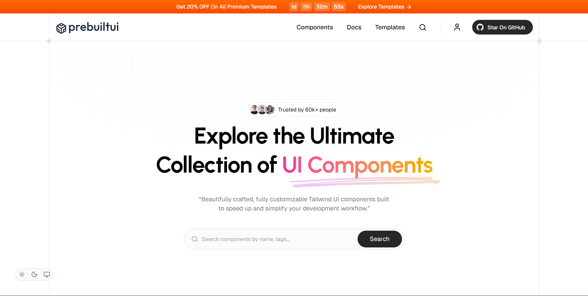

<h1 align="center">PrebuiltUI – Tailwind CSS UI Components</h1>

  

**PrebuiltUI** is a growing collection of beautifully crafted, ready-to-use UI components built with **Tailwind CSS**. Whether you're creating a **landing page**, **dashboard** or a full **SaaS application**, PrebuiltUI helps you build faster with clean, responsive and production-ready components.

---

## Support

If you like this UI components library, please **star the repo** on GitHub. It helps us grow!

---

### Features

- **Tailwind CSS First**
  Designed natively with Tailwind for maximum compatibility and ease of use.

- **Speed & Simplicity**
  Focused on rapid development without sacrificing design consistency.

- **Copy-Paste Ready**
  Components are production-ready out of the box — no setup required.

- **Versatile Use Cases**
  Perfect for developers, designers, startups and product teams.

---

## Contributing

We welcome contributions from the community!

1. Fork the repo
2. Create a new branch
3. Add your component/template in the right folder
4. Open a Pull Request

👉 See [CONTRIBUTING.md](./CONTRIBUTING.md) for details.

PrebuiltUI is an open-source project licensed under the [MIT License](./LICENSE).

---

> 🔗 **Explore the full component library**: [https://prebuiltui.com](https://prebuiltui.com?ref=github)
